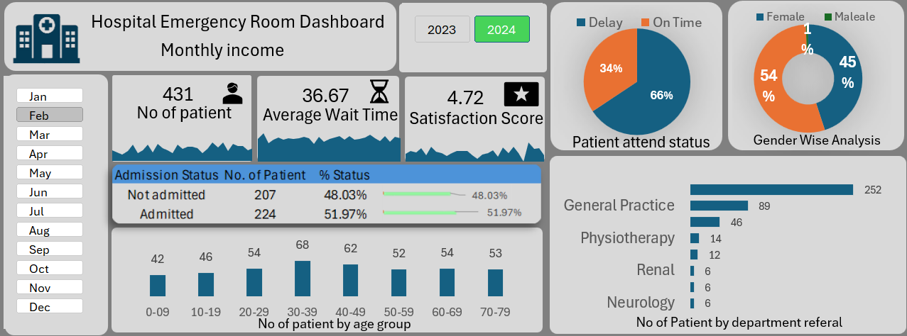

# Hospital Emergency Room Dashboard
# Dashboard Preview


# Hospital Emergency Room Dashboard
## Project Overview

The **Hospital Emergency Room Dashboard** is an interactive **Excel-based data visualization project** designed to analyze hospital emergency room data. The dashboard provides insights into **patient visits, waiting times, satisfaction scores, gender distribution, department referrals, and admission status**.

This project helps hospital administrators and healthcare analysts monitor **patient flow, operational efficiency, and service performance** in the emergency department.

---

# Objectives

The main objectives of this dashboard are:

* Monitor **monthly patient visits**
* Track **average waiting time**
* Measure **patient satisfaction score**
* Analyze **gender-wise patient distribution**
* Understand **patient admission status**
* Identify **department referral trends**
* Analyze **age-group wise patient visits**
* Track **on-time vs delayed patient attendance**

---

# Dashboard Features

## 1️⃣ KPI Metrics

The dashboard displays key hospital performance indicators:

* **Total Number of Patients:** 431
* **Average Wait Time:** 36.67 minutes
* **Patient Satisfaction Score:** 4.72 / 5

These KPIs help evaluate emergency department performance quickly.

## 2️⃣ Monthly Filter
A **month-wise slicer (Jan – Dec)** allows users to filter the data and analyze trends for specific months.
## 3️⃣ Year Selection

Users can switch between:

* **2023**
* **2024**

This enables year-wise comparison of hospital performance.

## 4️⃣ Patient Attend Status

A pie chart displays whether patients were attended:

* **On Time – 66%**
* **Delayed – 34%**

This helps measure hospital efficiency in handling emergency cases.

## 5️⃣ Gender-wise Analysis

A donut chart shows gender distribution of patients:

* **Male – 54%**
* **Female – 45%**
* **Other – 1%**

This provides demographic insights.


## 6️⃣ Admission Status

Displays patient admission results:

| Status       | Patients | Percentage |
| ------------ | -------- | ---------- |
| Not Admitted | 207      | 48.03%     |
| Admitted     | 224      | 51.97%     |

This helps track the percentage of patients requiring hospital admission.

---

## 7️⃣ Age Group Analysis

Shows patient distribution across age groups:

| Age Group | Patients |
| --------- | -------- |
| 0–9       | 42       |
| 10–19     | 46       |
| 20–29     | 54       |
| 30–39     | 68       |
| 40–49     | 62       |
| 50–59     | 52       |
| 60–69     | 54       |
| 70–79     | 53       |

This helps hospitals understand which age groups visit the emergency room most frequently.

## 8️⃣ Department Referral Analysis

Displays the number of patients referred to different departments:

| Department       | Patients |
| ---------------- | -------- |
| General Practice | 252      |
| Orthopedics      | 89       |
| Physiotherapy    | 46       |
| Cardiology       | 14       |
| Renal            | 12       |
| Neurology        | 6        |

This helps analyze department workload.

# Dashboard Insights

Some key insights from the dashboard:

* Most patients belong to the **30–39 age group**
* **66% of patients are attended on time**
* **General Practice receives the highest referrals**
* Slightly more **male patients than female patients**
* Around **52% of patients require admission**

```
Hospital-Emergency-Room-Dashboard
│
├── Hospital ER Dashboard.xlsx
├── Dashboard Screenshot.png
└── README.md
```

# Skills Demonstrated

This project demonstrates skills in:

* Data Analysis
* Data Visualization
* Excel Dashboard Development
* Pivot Tables & Charts
* KPI Design
* Interactive Reporting
